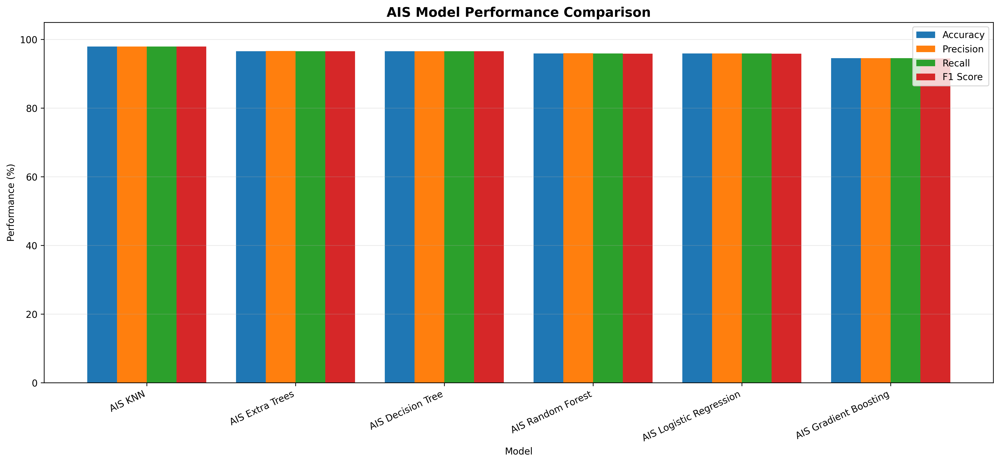

# AI-Based eGramSwaraj Accounting Performance Analysis and District-Level Classification

## Overview

The **AI-Based eGramSwaraj Accounting Performance Analysis and District-Level Classification** project is a Machine Learning-based system designed to analyze district-level accounting performance using data from the **eGramSwaraj platform**.

eGramSwaraj is used for strengthening transparency, planning, accounting, and monitoring activities associated with Panchayati Raj Institutions. The accounting dataset contains information related to different states and districts along with important financial and accounting indicators.

This project analyzes accounting indicators such as **eGramSwaraj onboarding, payment voucher initiation, payment voucher approval, and financial year closure** to calculate an overall accounting performance score for each district.

The districts are classified into three performance categories:

- **Low Performance**
- **Medium Performance**
- **High Performance**

The project combines traditional Machine Learning models with optimization techniques such as **Artificial Immune System (AIS)** and **Particle Swarm Optimization (PSO)** for intelligent feature selection and performance improvement.

---

## Project Objective

The main objective of this project is to develop an intelligent Machine Learning system capable of analyzing accounting activities across districts and identifying their overall accounting performance.

The project aims to:

- Analyze district-level eGramSwaraj accounting data.
- Clean and preprocess accounting indicators.
- Generate an Accounting Performance Score.
- Classify districts into Low, Medium, and High performance categories.
- Compare multiple Machine Learning algorithms.
- Evaluate models using Accuracy, Precision, Recall, and F1 Score.
- Apply Artificial Immune System (AIS) for feature optimization.
- Apply Particle Swarm Optimization (PSO) for feature optimization.
- Generate district-level performance predictions.
- Produce graphical visualizations for easier interpretation.
- Save trained models and configuration information for future use.

---

## Dataset

The project uses the following dataset:

```text
egramswaraj_accounting_20_21.csv
```

The dataset contains district-level accounting information from the eGramSwaraj system for the financial year **2020-21**.

### Important Dataset Attributes

Some of the important attributes used in this project include:

| Feature | Description |
|---|---|
| `state_name` | Name of the state |
| `district_name` | Name of the district |
| `onboard_egspi` | eGramSwaraj accounting onboarding indicator |
| `pv_initiated` | Number/value associated with payment vouchers initiated |
| `pv_approved` | Number/value associated with payment vouchers approved |
| `year_closed` | Financial year closure indicator |

The main numerical accounting indicators used for performance analysis are:

```text
onboard_egspi
pv_initiated
pv_approved
year_closed
```

---

## Project Workflow

The overall project workflow is:

```text
eGramSwaraj Dataset
        |
        v
Data Loading
        |
        v
Data Cleaning
        |
        v
Missing Value Handling
        |
        v
Duplicate Removal
        |
        v
Feature Normalization
        |
        v
Accounting Performance Score
        |
        v
Performance Classification
        |
        +----------------------+
        |                      |
        v                      v
Traditional ML          Optimization
Models                  Algorithms
        |                      |
        |              +-------+-------+
        |              |               |
        |              v               v
        |             AIS             PSO
        |              |               |
        +--------------+---------------+
                       |
                       v
              Feature Selection
                       |
                       v
                 Model Training
                       |
                       v
                 Model Evaluation
                       |
                       v
             District Predictions
                       |
                       v
               Result Generation
```

---

## Data Preprocessing

Several preprocessing operations are performed before training the Machine Learning models.

### 1. Column Name Cleaning

Column names are converted to lowercase and unnecessary spaces and special characters are removed.

For example:

```text
PV Initiated
```

becomes:

```text
pv_initiated
```

---

### 2. Duplicate Removal

Duplicate records are removed from the dataset to avoid biased model training.

---

### 3. Missing Value Handling

Numerical missing values are replaced using the **median value** of the corresponding feature.

Categorical missing values are replaced with:

```text
Unknown
```

---

### 4. Numerical Conversion

The accounting indicators are converted into numerical values before analysis.

The primary numerical features are:

```text
onboard_egspi
pv_initiated
pv_approved
year_closed
```

---

## Feature Normalization

The accounting indicators may have different numerical ranges.

Therefore, Min-Max normalization is applied:

```text
Normalized Value = (Value - Minimum) / (Maximum - Minimum)
```

The resulting normalized features are:

```text
onboard_egspi_normalized
pv_initiated_normalized
pv_approved_normalized
year_closed_normalized
```

The normalized values generally range between:

```text
0 and 1
```

---

## Accounting Performance Score

A combined **Accounting Performance Score** is calculated using the four major accounting indicators.

The weighted formula used in this project is:

```text
Performance Score =

(Onboard eGSPI × 0.20)
+
(PV Initiated × 0.25)
+
(PV Approved × 0.30)
+
(Year Closed × 0.25)
```

The resulting value is multiplied by `100` to obtain an interpretable performance score.

### Feature Weights

| Feature | Weight |
|---|---:|
| Onboard eGSPI | 20% |
| PV Initiated | 25% |
| PV Approved | 30% |
| Year Closed | 25% |

`pv_approved` receives the highest weight because successful voucher approval represents an important stage in the accounting workflow.

---

## Performance Classification

District records are divided into three performance categories.

The classification thresholds are calculated using quantiles from the Accounting Performance Score.

```text
Bottom 33%  -> Low Performance

Middle 33%  -> Medium Performance

Top 34%     -> High Performance
```

The classes are encoded as:

| Performance Class | Encoded Value |
|---|---:|
| Low | 0 |
| Medium | 1 |
| High | 2 |

The Machine Learning models use these classes as the prediction target.

---

# Machine Learning Models

Multiple Machine Learning algorithms are trained and evaluated to determine which model provides the best classification performance.

The models include:

### Random Forest Classifier

Random Forest combines multiple decision trees to produce more stable and accurate predictions.

It is useful for:

- Classification
- Feature importance analysis
- Non-linear datasets
- Reducing overfitting compared with individual decision trees

---

### Decision Tree Classifier

Decision Tree creates hierarchical decision rules based on the input accounting indicators.

Advantages include:

- Simple interpretation
- Fast training
- Ability to model non-linear relationships

---

### Gradient Boosting Classifier

Gradient Boosting creates multiple weak learners sequentially, with each new model attempting to correct errors from previous models.

It can provide strong predictive performance on structured datasets.

---

### Extra Trees Classifier

Extra Trees uses highly randomized decision trees.

The additional randomness can improve model generalization and provide an effective comparison with Random Forest.

---

### Logistic Regression

Logistic Regression provides a simpler statistical baseline for the multi-class classification problem.

---

### K-Nearest Neighbors

KNN predicts the performance category based on neighboring records with similar accounting characteristics.

---

# Model Evaluation

The trained models are evaluated using multiple classification metrics.

## Accuracy

Accuracy represents the proportion of correctly classified records.

```text
Accuracy = Correct Predictions / Total Predictions
```

---

## Precision

Precision measures how many records predicted as belonging to a class actually belong to that class.

```text
Precision = TP / (TP + FP)
```

---

## Recall

Recall measures how many actual records belonging to a class were correctly identified.

```text
Recall = TP / (TP + FN)
```

---

## F1 Score

F1 Score combines Precision and Recall.

```text
F1 Score = 2 × (Precision × Recall) / (Precision + Recall)
```

Weighted Precision, Recall, and F1 Score are used to account for the distribution of records across performance classes.

---

# Artificial Immune System (AIS)

The project uses an **Artificial Immune System (AIS)** optimization technique for feature selection.

AIS is inspired by the biological immune system, where antibodies evolve to recognize and respond effectively to antigens.

In this project, an antibody represents a candidate feature subset.

For example:

```text
[1, 0, 1, 1]
```

means:

```text
onboard_egspi = Selected
pv_initiated  = Not Selected
pv_approved   = Selected
year_closed   = Selected
```

---

## AIS Clonal Selection Process

The AIS optimization process follows these major steps:

```text
Initialize Antibody Population
        |
        v
Evaluate Fitness
        |
        v
Select Best Antibodies
        |
        v
Clone Strong Antibodies
        |
        v
Apply Mutation
        |
        v
Evaluate New Antibodies
        |
        v
Retain Best Solutions
        |
        v
Introduce Diversity
        |
        v
Repeat for Multiple Generations
        |
        v
Best Feature Subset
```

---

## AIS Fitness Function

The fitness of an antibody is evaluated using Machine Learning classification accuracy.

The project uses:

```text
Random Forest
+
3-Fold Stratified Cross-Validation
```

The objective is:

```text
Maximize Cross-Validation Accuracy
```

The feature subset with the highest fitness is selected.

---

## AIS Parameters

The implementation uses parameters such as:

```text
Population Size = 20
Generations     = 25
Clone Factor    = 5
Elite Size      = 5
Mutation Rate   = 0.20
```

These parameters control the evolutionary feature-selection process.

---

# AIS Model Comparison

After AIS identifies the optimized feature subset, multiple Machine Learning models are trained using the selected features.

The AIS models include:

```text
AIS Random Forest
AIS Extra Trees
AIS Decision Tree
AIS Gradient Boosting
AIS Logistic Regression
AIS KNN
```

The models are compared using:

```text
Accuracy
Precision
Recall
F1 Score
```

---

## AIS Performance Visualization

The following visualization compares the performance of Machine Learning models trained using AIS-selected features.



The graph provides a comparison of:

- Accuracy
- Precision
- Recall
- Weighted F1 Score

across the AIS-optimized Machine Learning models.

---

# Particle Swarm Optimization (PSO)

The project also implements **Particle Swarm Optimization (PSO)** for feature selection.

PSO is a population-based optimization algorithm inspired by the movement and collective behavior of bird flocks and fish schools.

Each particle represents a possible feature subset.

Example:

```text
[1, 1, 0, 1]
```

means:

```text
onboard_egspi = Selected
pv_initiated  = Selected
pv_approved   = Not Selected
year_closed   = Selected
```

---

## Binary PSO

Because feature selection is a binary optimization problem, this project uses **Binary Particle Swarm Optimization**.

Each feature has one of two possible states:

```text
0 = Feature not selected

1 = Feature selected
```

Particle velocities are transformed into selection probabilities using a sigmoid function.

```text
S(v) = 1 / (1 + e^(-v))
```

The feature is then selected or excluded according to this probability.

---

## PSO Optimization Process

```text
Initialize Particle Swarm
        |
        v
Calculate Particle Fitness
        |
        v
Update Personal Best
        |
        v
Update Global Best
        |
        v
Update Particle Velocity
        |
        v
Apply Sigmoid Function
        |
        v
Update Binary Position
        |
        v
Repeat for Multiple Iterations
        |
        v
Select Global Best Feature Subset
```

---

## PSO Fitness

Similar to AIS, PSO evaluates feature subsets using:

```text
Random Forest
+
3-Fold Stratified Cross-Validation
```

The objective is to maximize classification accuracy.

---

## PSO Parameters

The PSO implementation uses:

```text
Particles             = 20
Iterations            = 25
Inertia Weight        = 0.729
Cognitive Coefficient = 1.49445
Social Coefficient    = 1.49445
```

---

# Base ML vs AIS vs PSO

The complete project therefore contains three approaches.

| Approach | Description |
|---|---|
| Base ML | Classification using the complete feature set |
| AIS | Artificial Immune System-based feature optimization |
| PSO | Particle Swarm Optimization-based feature optimization |

This allows the project to investigate whether optimization-based feature selection improves model performance.

---

# Confusion Matrix

A confusion matrix is generated for the best-performing classification model.

The confusion matrix represents:

```text
Actual Class vs Predicted Class
```

for:

```text
Low
Medium
High
```

It helps identify which performance categories are classified correctly and where misclassification occurs.

---

# Prediction Analysis

The project generates district-level predictions containing information such as:

```text
State
District
Onboard eGSPI
PV Initiated
PV Approved
Year Closed
Performance Score
Actual Class
Predicted Class
Prediction Probability
Correct Prediction
```

This allows detailed inspection of individual district records.

---

# Output Files

The project generates multiple output files.

## Base Model Outputs

```text
accuracy_graph.png
heatmap.png
comparison_graph.png
result.csv
result_graph.png
prediction.csv
prediction_graph.png
egramswaraj_model.pkl
egramswaraj_model.h5
egramswaraj_config.yaml
egramswaraj_metadata.json
```

---

## AIS Outputs

```text
ais_accuracy_graph.png
ais_heatmap.png
ais_comparison_graph.png
ais_result.csv
ais_result_graph.png
ais_prediction.csv
ais_prediction_graph.png
ais_feature_selection_graph.png
ais_fitness_graph.png
ais_class_distribution_graph.png
ais_model.pkl
ais_model.h5
ais_config.yaml
ais_metadata.json
```

---

## PSO Outputs

```text
pso_accuracy_graph.png
pso_heatmap.png
pso_comparison_graph.png
pso_result.csv
pso_result_graph.png
pso_prediction.csv
pso_prediction_graph.png
pso_feature_selection_graph.png
pso_fitness_graph.png
pso_class_distribution_graph.png
pso_model.pkl
pso_model.h5
pso_config.yaml
pso_metadata.json
```

---

# Output File Description

| File | Description |
|---|---|
| `accuracy_graph.png` | Accuracy comparison between base ML models |
| `heatmap.png` | Confusion matrix of the best base model |
| `comparison_graph.png` | Comparison of Accuracy, Precision, Recall, and F1 Score |
| `result.csv` | Performance metrics of trained models |
| `result_graph.png` | Graphical representation of model results |
| `prediction.csv` | District-level predictions |
| `prediction_graph.png` | Actual vs predicted class comparison |
| `ais_comparison_graph.png` | Performance comparison of AIS-optimized models |
| `ais_feature_selection_graph.png` | Features selected by AIS |
| `ais_fitness_graph.png` | AIS optimization convergence |
| `ais_class_distribution_graph.png` | Distribution of performance classes |
| `pso_feature_selection_graph.png` | Features selected by PSO |
| `pso_fitness_graph.png` | PSO optimization convergence |
| `pso_comparison_graph.png` | Comparison of PSO-optimized models |

---

# Saved Model Files

The project stores trained models and configuration information in multiple formats.

## PKL

```text
egramswaraj_model.pkl
ais_model.pkl
pso_model.pkl
```

The `.pkl` files contain the trained Machine Learning model along with preprocessing and feature-selection information.

---

## H5

```text
egramswaraj_model.h5
ais_model.h5
pso_model.h5
```

The HDF5 files store model metadata, selected features, optimization information, scaler parameters, confusion matrices, and performance information.

---

## YAML

```text
egramswaraj_config.yaml
ais_config.yaml
pso_config.yaml
```

YAML files contain human-readable configuration information including:

```text
Model settings
Feature information
Optimization parameters
Dataset information
Performance thresholds
```

---

## JSON

```text
egramswaraj_metadata.json
ais_metadata.json
pso_metadata.json
```

JSON files contain structured project metadata, model results, classification reports, feature-selection information, and generated-file information.

---

# Project Directory Structure

A possible project directory structure is:

```text
eGramSwaraj Accounting Performance Analysis/
│
├── egramswaraj_accounting_20_21.csv
│
├── README.md
│
├── main.py
├── ais_model.py
├── pso_model.py
│
├── egramswaraj_model.pkl
├── egramswaraj_model.h5
├── egramswaraj_config.yaml
├── egramswaraj_metadata.json
│
├── accuracy_graph.png
├── heatmap.png
├── comparison_graph.png
├── result.csv
├── result_graph.png
├── prediction.csv
├── prediction_graph.png
│
├── ais_model.pkl
├── ais_model.h5
├── ais_config.yaml
├── ais_metadata.json
├── ais_accuracy_graph.png
├── ais_heatmap.png
├── ais_comparison_graph.png
├── ais_result.csv
├── ais_result_graph.png
├── ais_prediction.csv
├── ais_prediction_graph.png
├── ais_feature_selection_graph.png
├── ais_fitness_graph.png
├── ais_class_distribution_graph.png
│
├── pso_model.pkl
├── pso_model.h5
├── pso_config.yaml
├── pso_metadata.json
├── pso_accuracy_graph.png
├── pso_heatmap.png
├── pso_comparison_graph.png
├── pso_result.csv
├── pso_result_graph.png
├── pso_prediction.csv
├── pso_prediction_graph.png
├── pso_feature_selection_graph.png
├── pso_fitness_graph.png
└── pso_class_distribution_graph.png
```

---

# Technologies Used

The project is developed using:

```text
Python
Pandas
NumPy
Scikit-learn
Matplotlib
H5Py
PyYAML
Pickle
JSON
```

---

# Installation

Install the required Python libraries using:

```bash
pip install pandas numpy scikit-learn matplotlib h5py pyyaml
```

If Jupyter Notebook is being used:

```bash
pip install notebook
```

Start Jupyter using:

```bash
jupyter notebook
```

---

# Running the Project

Place the dataset inside the project directory:

```text
C:\Users\sagni\Downloads\eGramSwaraj Accounting Performance Analysis\egramswaraj_accounting_20_21.csv
```

Run the base Machine Learning program first.

Then run the AIS optimization program to generate:

```text
ais_*
```

outputs.

Finally, run the PSO optimization program to generate:

```text
pso_*
```

outputs.

All generated files will be stored in:

```text
C:\Users\sagni\Downloads\eGramSwaraj Accounting Performance Analysis
```

---

# Key Features

The major features of this project are:

- District-level accounting performance analysis
- Automated data preprocessing
- Accounting Performance Score generation
- Low, Medium, and High performance classification
- Multiple Machine Learning algorithms
- Accuracy, Precision, Recall, and F1 Score evaluation
- Confusion matrix generation
- Artificial Immune System optimization
- AIS Clonal Selection-based feature selection
- Particle Swarm Optimization
- Binary PSO feature selection
- Optimization convergence analysis
- District-level predictions
- Prediction probability analysis
- CSV result generation
- Graphical result visualization
- PKL model storage
- HDF5 model metadata storage
- YAML configuration generation
- JSON metadata generation

---

# Applications

The proposed system can be useful for:

### Government Accounting Monitoring

The model can assist in identifying districts showing relatively strong or weak accounting activity according to the selected eGramSwaraj indicators.

### District Performance Analysis

Districts can be grouped into:

```text
Low
Medium
High
```

performance categories for comparative analysis.

### Administrative Decision Support

The generated performance information can help analysts identify districts that may require additional investigation or administrative attention.

### Accounting Workflow Analysis

Indicators such as payment voucher initiation, approval, and year closure can be analyzed together instead of independently.

### Comparative State Analysis

District-level results can also be aggregated to analyze broader accounting patterns across states.

---

# Advantages of the Proposed System

The proposed system provides several advantages:

- Automated analysis of accounting data
- Simple district-level performance classification
- Multiple model comparison
- Optimization-based feature selection
- Reproducible Machine Learning workflow
- Graphical representation of results
- Structured prediction reports
- Reusable trained models
- Multiple model-storage formats
- Easy extension to future eGramSwaraj datasets

---

# Limitations

The current implementation also has important limitations.

The performance class is **derived from the same accounting indicators that are subsequently used as Machine Learning input features**.

Therefore, very high classification accuracy may occur because the Machine Learning model is learning the mathematical relationship used to construct the target rather than predicting an independently observed government performance label.

For this reason, the current project should primarily be interpreted as:

> **Machine Learning-based classification of a derived eGramSwaraj Accounting Performance Index.**

It should not automatically be interpreted as an official assessment of whether a district is administratively successful or unsuccessful.

Additional independent outcome variables would be required for stronger real-world predictive conclusions.

---

# Future Enhancements

The project can be extended in several ways.

### Multi-Year Analysis

Datasets from multiple financial years can be integrated to identify changes in accounting performance over time.

### Time-Series Forecasting

Future accounting activity could be forecast using:

```text
ARIMA
LSTM
GRU
Prophet
```

### State-Level Dashboard

An interactive dashboard could be developed using:

```text
Streamlit
Plotly
Power BI
Tableau
```

### Geographic Visualization

District-level performance could be displayed on an interactive map of India.

### Advanced Optimization

Additional optimization techniques could be compared, such as:

```text
Genetic Algorithm
Grey Wolf Optimization
Ant Colony Optimization
Differential Evolution
Whale Optimization Algorithm
```

### Explainable AI

Techniques such as:

```text
SHAP
LIME
Feature Importance
Partial Dependence Plots
```

could be incorporated to explain model predictions.

### Independent Performance Labels

Future versions should ideally use independently observed administrative or financial outcomes as the target variable rather than deriving the target directly from the predictor variables.

---

# Conclusion

The **AI-Based eGramSwaraj Accounting Performance Analysis and District-Level Classification** project demonstrates how Machine Learning and bio-inspired optimization techniques can be applied to government accounting datasets.

The system processes district-level eGramSwaraj accounting indicators, calculates an Accounting Performance Score, and categorizes district records into **Low, Medium, and High performance groups**.

Multiple Machine Learning algorithms are evaluated using Accuracy, Precision, Recall, and F1 Score.

The project further integrates **Artificial Immune System (AIS)** and **Particle Swarm Optimization (PSO)** to perform intelligent feature selection. AIS uses a Clonal Selection strategy, while PSO uses swarm intelligence to search for useful combinations of accounting indicators.

The AIS model comparison is visualized using:


Overall, the project provides an end-to-end framework covering **data preprocessing, performance-index generation, Machine Learning classification, AIS optimization, PSO optimization, model evaluation, district-level prediction, visualization, and model persistence**.

---

# Project Title

**AI-Based eGramSwaraj Accounting Performance Analysis and District-Level Classification Using Machine Learning, Artificial Immune System, and Particle Swarm Optimization**

---

# Visualization


